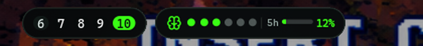
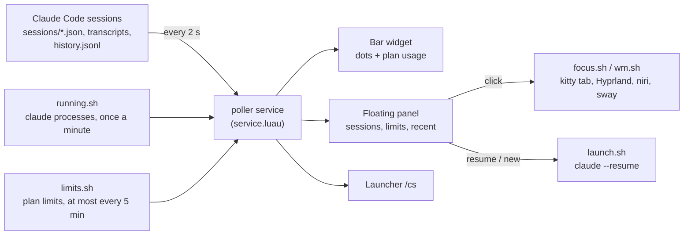

# Claude Sessions for Noctalia

Every [Claude Code](https://claude.com/claude-code) session at a glance in the [Noctalia](https://github.com/noctalia-dev/noctalia) bar: which ones are working, which are waiting for you, what each is doing right now, and how much of your plan is left. Click a session to jump straight to its terminal, down to the exact kitty tab.

This is a fork of [lfdominguez/claude-sessions](https://github.com/noctalia-dev/community-plugins/tree/main/claude-sessions) 1.5.2 from the Noctalia community plugins. The main change is a panel that floats as its own card, so it works with transparent and floating bars.




## What it shows

- Sessions that need you jump to the top, turn the bar icon into a red bell and send a desktop notification.
- What each session is doing: the tool it's running, todo progress, your last prompt, model, permission mode, context size and estimated cost.
- Plan limits: 5-hour, 7-day and per-model weekly usage with reset countdowns.
- Jump to the terminal: click a session to focus its window. On kitty it lands on the exact tab or split.
- Resume and start sessions: reopen recently closed sessions, or start a new one in a recent project.
- Keyboard and launcher: move through the panel with the keyboard, or search sessions from the launcher with `/cs`.
- Several accounts: sessions with different `CLAUDE_CONFIG_DIR`s are grouped per account, each with its own limits.
- Works on Hyprland, niri and sway.

## Changes in this fork

| | Upstream 1.5.2 | This fork |
|---|---|---|
| Panel placement | Attached to the bar, using the bar's background | Floating card with its own background, border and shadow |
| Plugin ID | `lfdominguez/claude-sessions` | `hani/claude-sessions`, so both can be installed side by side |
| Updates | Community source | This repo, as its own Noctalia plugin source |

With an attached panel and a transparent bar (`background_opacity = 0`), the panel has nothing behind it and its content floats over your windows. A floating panel brings its own card, which also suits floating or pill-style bars.

## How it works



Everything is read locally from Claude Code's own files. The only network call is the optional plan-limits request, made with each account's own token, which is passed to `curl` on stdin and never written anywhere. The plugin's [README](claude-sessions/README.md#notes) lists every file it reads and every command it runs.

## Install

Add this repo as a plugin source and enable the plugin:

```sh
noctalia msg plugins source add claude-sessions-fork git https://github.com/h1n054ur/noctalia-claude-sessions
noctalia msg plugins enable hani/claude-sessions
```

Then put the widget on a bar in `~/.config/noctalia/config.toml`:

```toml
[widget.claude]
type = "hani/claude-sessions:bar"

[bar.default]
start = [ "workspaces", "claude" ]
```

If you used the community version before, disable it with `noctalia msg plugins disable lfdominguez/claude-sessions`.

For a local copy you can edit, clone the repo and link the plugin folder into `~/.local/share/noctalia/plugins/`, where Noctalia picks it up as a local plugin:

```sh
git clone https://github.com/h1n054ur/noctalia-claude-sessions
ln -s "$PWD/noctalia-claude-sessions/claude-sessions" ~/.local/share/noctalia/plugins/claude-sessions
```

Requirements: Claude Code 2.1 or newer, `jq`, `curl` and `xdg-open`, plus `hyprctl`, `niri` or `swaymsg` for focusing windows. kitty with remote control gives exact tab focusing; the plugin's README explains the two `kitty.conf` lines.

## Docs

The full guide is in [claude-sessions/README.md](claude-sessions/README.md): bar styles, the panel and its keyboard shortcuts, several accounts, the launcher, every setting, IPC commands, privacy notes and troubleshooting.

## Credits and licence

The plugin was written by [lfdominguez](https://github.com/lfdominguez) and published in [noctalia-dev/community-plugins](https://github.com/noctalia-dev/community-plugins) under the MIT licence. This fork keeps that licence; see [LICENSE](LICENSE). The screenshots in `claude-sessions/images` are from the original plugin.
